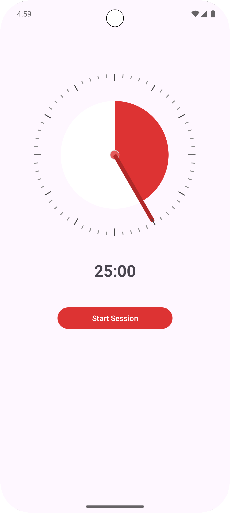

# Android Pomodoro Style Timer Widget Library
## How to Use?
### 1. Add dependency
#### gradle.kts
1. Add it in your settings.gradle.kts
```gradle
dependencyResolutionManagement {
	repositoriesMode.set(RepositoriesMode.FAIL_ON_PROJECT_REPOS)
	repositories {
		mavenCentral()
		maven { url = uri("https://jitpack.io") }
	}
}
```
2. Add the dependency
```gradle
dependencies {
	implementation("com.github.orion-gz:Pomodoro-Timer-Widget:Tag")
}
```
#### gradle
<details>
<summary>preview</summary>

1. Add it in your root settings.gradle at the end of repositories
```gradle
dependencyResolutionManagement {
	repositoriesMode.set(RepositoriesMode.FAIL_ON_PROJECT_REPOS)
	repositories {
		mavenCentral()
		maven { url 'https://jitpack.io' }
	}
}
```
2. Add the dependency
```gradle
dependencies {
	implementation 'com.github.orion-gz:Pomodoro-Timer-Widget:Tag'
}
```

</details>

#### maven
<details>
<summary>preview</summary>

1. Add to pom.xml
```xml
<repositories>
	<repository>
	    <id>jitpack.io</id>
	    <url>https://jitpack.io</url>
	</repository>
</repositories>
```
2. Add the dependency
```xml
<dependency>
    <groupId>com.github.orion-gz</groupId>
    <artifactId>Pomodoro-Timer-Widget</artifactId>
    <version>Tag</version>
</dependency>
```

</details>

### 2. Add Widget Component in Layout File
```xml
<orion.gz.pomodorotimer.TimerView
        android:id="@+id/timer_view"
        android:layout_width="300dp"
        android:layout_height="300dp"
		app:circle_color=""
        app:hand_color=""
        app:knob_color="" />
```
There are 3 attributes for widget
1. OutCircle Color
2. InnerCircle Color
3. Hand Color

```xml
<!-- OutCircle Color -->
app:circle_color=""
<!-- Inner Circle Color -->
app:knob_color="" 
<!-- Hand Color -->
app:hand_color=""
```

#### Recommend Color Pattern
Determine the minute hand and inner circle based on the **OuterCircle color**

Set OutCircle Color as `int color = getResources().getColor(R.color.~~);`

For Hand Color `ColorUtils.blendARGB(color, Color.BLACK, 0.2F);`

For InnerCircle Color `ColorUtils.blendARGB(color, Color.WHITE, 0.2F);`


**Example Code**
```java
TimerView timerView = findViewById(R.id.timer_view);

// Change Timer Component's Color
// I STRONGLY recommend this color pattern
int color = getResources().getColor(R.color.c5);
int brightColor = ColorUtils.blendARGB(color, Color.WHITE, 0.2F);
int darkColor = ColorUtils.blendARGB(color, Color.BLACK, 0.2F);

timerView.setCirlceColor(color);
timerView.setHandColor(darkColor);
timerView.setKnobColor(brightColor);
```

#### ScreenShot
<details>
<summary>preview</summary>




</details>

### 3. Listener
When adjusting the timer by touch, it returns the time indicated by the minute hand each time the time changes.
```java
private void updateTimerView() {
    timerView.setOnTimerChangeListener(new OnTimerChangeListener() {
        @Override
        public void onTimerChanged(long minutes, long seconds) {
            currentMinutes = minutes;
            currentSeconds = seconds;
            updateTimeText();
        }
    });
}
```

### 4. Functions
<details>
<summary>preview</summary>

* Set Timer time

```java
// Set View by Time
public void setTime(long minutes, long seconds) {
    this.minutes = minutes;
    this.seconds = seconds;
    float ratio = (minutes * 60 + seconds) / 3600F;
    setRemainingRatio(ratio);
}
```

* Update Time by Ratio of Timer Arc
```java
// Update Time by angle of arc
// Function to get time according to angle
public void updateTime() {
    int totalSeconds = (int) (remainingRatio * 60 * 60);
    minutes = totalSeconds / 60 + turns * 60;
    seconds = totalSeconds % 60;    

	if (timeListener != null)
    	timeListener.onTimerChanged(minutes, seconds);
}
```

* Set Timer Arc's angle

```java
// Set angle of Arc and Update time
public void setRemainingRatio(float ratio) {
    this.remainingRatio = ratio;
    updateTime();
    invalidate();
}
```

* Touch Blocking

```java
public void setTouchable(boolean touchable) {
    isTouchable = touchable;
}
```

* Reset Rotation

```java
// Reset rotation variables
public void resetRotation() {
    totalRotation = 0;
    lastAngle = -1;
}
```

* Color Attributes Setters

```java
/** Setter for Attr **/
public void setCirlceColor(@ColorInt int color) {
    this.circleColor = color;
    if (redCircle != null)
        redCircle.setColor(color);
    invalidate();
}

public void setKnobColor(@ColorInt int color) {
    this.knobColor = color;
    if (knobCircle != null)
        knobCircle.setColor(color);
    invalidate();
}

public void setHandColor(@ColorInt int color) {
    this.handColor = color;
    if (hand != null)
        hand.setColor(color);
    invalidate();
}
/** Setter for Attr **/
```
</details>

## DEMO APP
### ScreenShot


### DEMO Gif


